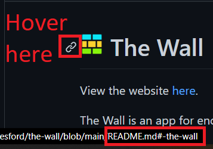

#  The Wall

View the website [here](https://the-wall-app.netlify.app/).

The Wall is an app for encouraging users to keep active by giving them a fun goal to focus on during their walk, run, cycle, etc.

Each day, a new theme appears at the top of the page, such as 'Nature' or 'Statues'. The idea being that during the user's exercise, they try to find and photograph something that matches that day's theme. They can then submit their photo to the website, view other users' posts, and vote on their favourites.

## Contents

1. [Purpose](#purpose)

2. [Tech stack](#tech-stack)

3. [Features & lessons learned](#features--lessons-learned) (most recently added features listed first)

    - [Websockets for realtime data](#websockets-for-realtime-data)
    - [Adding routes](#adding-routes)
    - [Getting images in different sizes, to increase performance](#getting-images-in-different-sizes-to-increase-performance)
    - [Counting 'likes' (i.e. tracking favourites)](#counting-likes-ie-tracking-favourites)
    - [Icon animation](#icon-animation)
    - [Mobile responsiveness](#mobile-responsiveness)
    - [Loading animation](#loading-animation)
    - [Image modal](#image-modal)
    - [Hamburger menu](#hamburger-menu)
    - [Sticky navbar](#sticky-navbar)
    - [Markdown anchors](#markdown-anchors)

4. [Future plans](#future-plans)

5. [Acknowledgements](#acknowledgements)

## Purpose

With this project, the app itself (a photography sharing / fitness motivator website) was not hugely important. My goal with this project was to try to create commonly used features from scratch, in order to better understand how they work. For example, I've implemented hamburger menus in past projects by importing them from component libraries such as MUI, but I wanted to try writing such a menu myself.

In the [Features & lessons learned](#features--lessons-learned) section below, I've detailed the features I've been able to add to the app so far, how they were implemented, any difficulties I ran into, any useful links to resources I found helpful when trying to implement the feature, and any takeaways for the future.

[Back to top](#-the-wall)

## Tech stack

Front-end: React (CRA)

Back-end: Node/Express

[Back to top](#-the-wall)

## Features & lessons learned:

### Websockets for realtime data

- Each image on the page has a counter showing the number of users who have 'starred' (liked) it. A user could get the most up to date figures by reloading the page, but I wanted the figures to update in realtime without the user having to hit refresh. I looked into how this can be done, and read about long polling and websockets. I went with the latter, as the resources I read indicated that websockets were the replacement for the older polling methods.

- This was the most difficult feature I've implemented yet. I did a lot of reading around websockets (and the syntax in Node). There are lots of good guides online, but a lot of work was needed to adapt the guides to my use-case. 

- I also learned what 'things' can be sent over a websocket, as I originally thought I could just send a normal javascript object, but later found out I needed to stringify the object using the `JSON.stringify` method when sending a message, and then deserialize on receiving using `JSON.parse`. This made sense as I have seen how this is used for sending/receiving other messages to the server in the other fetch requests in the app.

- There was a lot of trial and error to get this to work. There were challenges with the messages not being broadcasted to other users (i.e. only returning to the sender), or sending multiple times (or not at all). This was partly being caused as the app runs in `StrictMode` in development, so this was not an issue in production.

- When a user stars/unstars an image, I wanted actions to occur roughly in the following order. I found this created the fastest experience for the user.

    - The image is starred/unstarred on the user's page just using state (i.e. not updating the database, just updating the client's instance)

    - Send a request to the server to update the database accordingly

    - Send a websocket message to broadcast an appropriate message to all ***other*** users

- Once I had this working locally, I then had to find out how to use websockets with Heroku, where the server is deployed.

- [NPM websocket package](https://www.npmjs.com/package/websocket)

- [https://blog.logrocket.com/websockets-tutorial-how-to-go-real-time-with-node-and-react-8e4693fbf843/](https://blog.logrocket.com/websockets-tutorial-how-to-go-real-time-with-node-and-react-8e4693fbf843/)

- [W3Schools JSON tutorial](https://www.w3schools.com/js/js_json.asp)

- [Using websockets with functional components](https://stackoverflow.com/questions/58432076/websockets-with-functional-components)

- [WebSockets with functional components](https://stackoverflow.com/questions/35535700/websockets-send-messages-and-notifications-to-all-clients-except-sender#:~:text=Websockets%3A%20send%20messages%20and%20notifications%20to%20all%20clients%20except%20sender,-Ask%20Question)

- [Websockets: send messages and notifications to all clients except sender](https://stackoverflow.com/questions/35535700/websockets-send-messages-and-notifications-to-all-clients-except-sender#:~:text=Websockets%3A%20send%20messages%20and%20notifications%20to%20all%20clients%20except%20sender,-Ask%20Question)

- [Using WebSockets on Heroku with Node.js](https://devcenter.heroku.com/articles/node-websockets)

[Back to top](#-the-wall)

---

### Adding routes

- I wanted separate pages where users could see their starred posts and their own posts. This was a good opportunity to practice with React Router and its new v6 syntax (in particular how `Switch` has been replaced with `Routes`, and how components are now passed down as an `element` prop to a `Route` instead of using children).

- In the page where users can manage their posts, each of their posts have an option for editing and/or deleting it. To use the delete option as an example, I originally had this sending a `DELETE` request to the server (to remove the post from the db), and then reload the page so that the user could see that the post had been deleted. However, reloading the page gave a 404 error. 

- This led to me reading about React Router's client-side routing, and how `Link`s in React Router don't actually trigger a refresh of the page (and how they just cause a page transition on the client-side, without any requests to the server). 

- I decided to change the functionality of the delete option to avoid needing to reload the page. This does however mean that a user cannot currently navitage to, for example, https://the-wall-app.netlify.app/posts directly from the address bar. They would need to navigate to the home page first, and then use the `Link` on the page.

- [React Router docs](https://v5.reactrouter.com/web/guides/quick-start)

- [Server-side vs Client-side routing](https://stackoverflow.com/questions/27928372/react-router-urls-dont-work-when-refreshing-or-writing-manually)

[Back to top](#-the-wall)

---

### Getting images in different sizes, to increase performance:

- I quickly noticed the page had a long load time. After running a Lighthouse check, I saw this was mainly down to the images it was loading. This made sense, as although the images are styled to a `height` of `300px`, I was still loading the full-sized images from the Cloudinary library where they're stored.

- Fortunately, I learned that Cloudinary has a really useful 'transform' tool, which allows you to obtain scaled down versions of an image. As such, rather than obtaining the full-sized image and then styling it down to `300px`, I could just obtain a `300px` `height` version of the image from Cloudinary:

        // Where 'image.url' is the full-sized image URL
        const smallImageUrl = image.url.slice(0, image.url.indexOf('upload') + 7) + 'c_scale,h_300/' + image.url.slice(image.url.indexOf('upload') + 7);

- This had the effect of significantly reducing the page load time.

- I've also used this for setting a `height` limit on the image obtained for the magnified modal of `1200px`. 

        // Where 'imageURL' is the full-sized image URL
        const modalImageResizedUrl = (imageUrl) => imageUrl.slice(0, imageUrl.indexOf('upload') + 7) + 'f_webp/c_scale,h_1200/' + imageUrl.slice(imageUrl.indexOf('upload') + 7);

- The `f_webp` part of the strings above is another Cloudinary transformation that delivers the images in WebP format, which I have read is more efficient. 

- [Cloudinary image optimization](https://cloudinary.com/documentation/image_optimization)

[Back to top](#-the-wall)

---

### Counting 'likes' (i.e. tracking favourites):

- This was my favourite feature to implement so far, as it was more focused on the back-end, which I have a slight preference for. I wanted to be able to track which users have favourited which images. 

- At this point, my database had just one table, called `images`, which had 3 columns: `id`, `url`, and `stars` (i.e. 'likes'). 

- I thought about the different ways I could store a users' likes in the db, and learned a lot from researching each option.

- I could add a `likes` column to the `images` table, which would be a list of the users who had liked that image, but this didn't *feel* like a good solution. And sure enough, it was very advised against. Editing such a cell (is 'cell' the correct term for a SQL db?) would be tricky and also time-consuming. I read that SQL is fast at looking through lots of cells, but would be slow at sifting through the same amount of information stored in a single cell.

- I then thought about storing the users' likes in a separate table called `stars`. Each column would be an image, and each row would be a user, and each cell would either just be `true` or `false` depending on whether that user had liked the image. This seemed like it would be easier to update, but it still didn't seem right, and I read that PostgreSQL has a maximum of 1600 columns. If I ever wanted to store more than 1600 images that would then be an issue.

- I eventually saw that a good way to track this would be to have a separate `stars` table, with just a `userid` column and an `imageid` column. If User 3 liked Image 7, that would get stored in the `stars` table, and its existence would indicate that User 3 had liked Image 7:

    | userid | imageid |
    | ------ | ------- |
    | 3      | 7       |

- This seemed a lot more "correct", as it was storing precisely the information needed (and no more), was easy to update, and wasn't trying to store everything in one monster of a table (which would miss the entire point of relational databases).

- I then really enjoyed figuring out the SQL queries needed. For example I could remove the `stars` column from the `images` table, as that could come from executing a `COUNT` on the `stars` table instead:

        // Query for getting all images including a count of their stars
        SELECT *, (SELECT count(*)::INT FROM stars WHERE stars.imageid = images.id) stars 
            FROM images 
        ORDER BY stars DESC;

- Takeaway: I have some habits from working so long with Excel that I need to unlearn!

[Back to top](#-the-wall)

---

### Icon animation:

- Clicking on the photographer icon in the NavBar causes it to spin and change.

- I'm using state to randomise the `src` of the `img` element, however changing the `src` alone would not cause the animation to replay each time. As I understand it, the animation only plays when the `img` element is rendered, so the animation would play on the initial page load but not when the `src` changes, as the content of the element is changing but it is not being re-rendered.

- This can be resolved by adding a `key` attribute to the `img` element, with the same value as the `src`. This will force React to unmount the current instance and mount a new one every time the `key`/`src` changes. E.g.:

        

- This is also what I'm using to re-order the images when an image is voted up higher than one that's currently above it:

        {images.map((image, index) => <GalleryImage image={image} key={[image.id, index]} ... />)}

    The `image.id` item in the `key` array is what I'm actually considering to be my key, and the `index` item is what causes the fade-in animation to play when the images get re-ordered.

- [Understanding React's key prop](https://kentcdodds.com/blog/understanding-reacts-key-prop)

[Back to top](#-the-wall)

---

### Mobile responsiveness

- I wanted to try making the app responsive for mobile. Fortunately the app already scaled down quite nicely on smaller screens, but the navbar in particular would become quite crowded, and some of the modals (e.g. for making a post, or the information modal) would overflow the edge of the screen.

- I had only very briefly seen and used media queries up till now, but in this case they were quite straightforward to add in.

- I found the easiest approach was to use the device toolbar in Chrome's developer tools, and slowly decrease the width of the screen until the size/positioning of some part of the app becomes an issue. Then I would add in a breakpoint at that particular width, and modify relevant CSS selectors accordingly (usually by decreasing `font-size` or `margin`, or removing some elements from the page using `display: none`). Then I would repeat the process until the screen reached around 100px (it's unlikely that anyone would be using the app at sizes smaller than this).

- [Media Query CSS Tutorial – Standard Resolutions, CSS Breakpoints, and Target Phone Sizes](https://www.freecodecamp.org/news/css-media-queries-breakpoints-media-types-standard-resolutions-and-more/)

[Back to top](#-the-wall)

---

### Loading animation:

- The [image modal](#image-modal) feature above included a `Loading...` message as part of its functionality, and I wanted to replace this with a loading animation instead (my reasoning is that compared with a static loading message, an animation makes it *feel* like something is actually loading).

- I was familiar with `keyframes` by this point after making the [hamburger menu](#hamburger-menu) and [image modal](#image-modal) components, so I began with just having an image that rotates 360deg infinitely, and that worked fine. 

- I then looked into how others have made 'loaders', and saw [a guide from W3Schools](https://www.w3schools.com/howto/howto_css_loader.asp) that has a really nice way of making the loader just with CSS. I love neat solutions like this. And of course, people have made all sorts of amazing loaders purely with CSS. I'd like to try designing and making one of these myself at some point.

- Later on, I reused the `Loader` component as part of the main fetch request that obtains all of the images on the front page. Using state and conditional rendering, the `Loader` component is rendered initially, and is then replaced by all of the images once they're received from the server/Cloudinary. From looking into the [Vue docs](https://vuejs.org/guide/essentials/conditional.html#v-if-vs-v-show) when I was making the [hamburger menu](#hamburger-menu), I now knew that conditional rendering would be the 'cheapest' option in this situation, as the main fetch request should only occur once for each visit, and so the state that controls the conditional render should only be toggled once.

- [Single element CSS spinners by Luke Haas](https://projects.lukehaas.me/css-loaders/)

- [SpinKit by Tobias Ahlin](https://tobiasahlin.com/spinkit/)

[Back to top](#-the-wall)

---

### Image modal:

- I wanted users to be able click on an image and see a larger version as a modal.

- This involved figuring out how to have a magnifying glass icon appear over the centre of an image when the user hovers over it, and to open a modal containing that image when the icon is clicked. So far, this was similar to the implementation of the hamburger menu.

- The issue I had here was that when a user magnified an image, the image would take time to load. So I could either:

    1. Have the modal open instantly, but they would then see the previous image that had been magnified, and after a few seconds this would change to the new image they had just clicked on (once it had loaded), ***or***

    2. Have the new image load first **before** opening the modal, so they would only see the magnified image once it was ready, but then this meant a few seconds of delay where the user couldn't see anything happening.

- I decided to go with option 2, and to then figure out a way to tell the user that the image was loading and that it would open shortly. This turned out to not be as straightforward as I first anticipated, but it was very satisfying when I eventually figured out a solution.

- I determined that what I needed was a short `Loading...` message, whose visibility I could toggle using state (with either conditional rendering or with CSS classes as I touched on in the [hamburger menu](#hamburger-menu) section above).

- After some trial and error, I read about the `onLoad` attribute of `img` tags, and got partway to a solution by having (a) the `Loading...` message render as part of the magnified image modal component, (b) an `isImageLoaded` state that initialises as `false` and which sets the visiblity of the `Loading...` message, and (c) having the `isImageLoaded` state toggled to true in the callback when the `onLoad` event of the magnified image occurs. 

- However, I then needed a way to toggle the `isImageLoaded` state back to `false` when the user closes the modal, to reset the situation for the next time they magnify an image.

- A natural solution was to execute this in a `useEffect`, and to avoid causing an infinite loop, I added a `modalImage` variable (which is a prop to the modal component) to the dependency array. As such, the `isImageLoaded` state would only toggle back to false when the `modalImage` state changed (i.e. when a user magnified a new image).

- Takeaway: One solution I tried involved using several pieces of state. However, I found I was not getting the result I was expecting - sometimes the `Loading...` message wouldn't appear, or it would only appear *after* closing the modal, and many other unintended results.

    I eventually discovered that this was due to the fact that React sets state asynchronously, so that if I was executing code that sets multiple states sequentially, I could not rely on them actually being set in the order I had written. A valuable lesson!

- [GeeksforGeeks Is setState() method async?](https://www.geeksforgeeks.org/is-setstate-method-async/)

[Back to top](#-the-wall)

---

### Hamburger menu:

- Similar to the [sticky navbar](#sticky-navbar) I added a hamburger menu that is fixed in place. Its visibility depends on its classes, which are toggled using state. 

- The main 'new thing' I was trying here was to figure out how to make the menu close when a user clicks outside of it. 

- I did this by adding a `click` event listener to the document, and checking which CSS selectors the event occured closest to (i.e. if it wasn't closest to the `hamburger-menu` class, then that should cause the menu to become hidden). 

- This involved learning about event bubbling, event target selectors, and the `closest()` method of the event target object

- I later learned that in some cases it may be preferable to conditionally render something rather than simply using CSS to toggle its visibility. However for something that may be toggled often, the CSS route may have less cost. From Vue's docs: 
    > Generally speaking, v-if has higher toggle costs while v-show has higher initial render costs. So prefer v-show if you need to toggle something very often, and prefer v-if if the condition is unlikely to change at runtime.

- [W3Schools HowTo Mobile Navigation Menu](https://www.w3schools.com/howto/howto_js_mobile_navbar.asp)

- [MDN Web Docs Using CSS Transitions](https://developer.mozilla.org/en-US/docs/Web/CSS/CSS_Transitions/Using_CSS_transitions)

- [DelftStack Slide in From Left Transition in CSS](https://www.delftstack.com/howto/css/slide-in-from-left-transition-in-css/)

- [Conditionally rendering vs toggling visiblity with CSS](https://stackoverflow.com/questions/56229860/conditionally-rendering-markup-jsx-vs-css-display-none-which-is-better-p)

- [Vue Docs v-if vs v-show](https://vuejs.org/guide/essentials/conditional.html#v-if-vs-v-show)

- [Techstacker closing a modal when users click outside it](https://techstacker.com/close-modal-click-outside-vanilla-javascript/)

- [How to close modals on clicking outside](https://stackoverflow.com/questions/37573608/how-to-make-modal-close-on-click-outside#:~:text=Another%20way%20to%20dismiss%20the,nature%20of%20the%20javascript%20events.&text=clicking%20on%20.,modal%2Droot%20%2D%3E%20body%20.)

[Back to top](#-the-wall)

---

### Sticky navbar:

- The app is designed for users to scroll down the page to see more photos, so it made sense to include a sticky navbar for quick access.

- It turns out there are many ways to do this, but I think the simplest way (and sufficient in this case) was to style the `nav` and `main` tags as follows:

        nav {
            position: fixed;
            height: 40px;
        }

        main {
            margin-top: 40px;
        }

    This was made easy due to the HTML structure of the app:

        

            <nav>..</nav>
            <main>..</main>
        

- A takeaway I had from looking into this was that when you understand how other developers have implemented a feature previously, it's not too difficult to adapt it for your project, and to account for any changes that may be desirable or needed. For example, the W3Schools guide below uses JS, but I was able to implement this here just with CSS.

- [W3Schools HowTo Sticky/Affix Navbar](https://www.w3schools.com/howto/howto_js_navbar_sticky.asp)

[Back to top](#-the-wall)

---

### Markdown anchors:

- I wanted to include a 'Back to top' link after each section in this README, and in GitHub flavoured markdown this would usually be done here with:

        # The Wall
        .
        .
        .
        [Back to top](#the-wall)

    However (as you can check in the raw markdown) I've included an image in the main header, so the anchor above wouldn't work in this case, and it was difficult to determine what the anchor needed to be. 

- It turns out GitHub has a tool for showing you what the anchor should be. Simply open the README file in GitHub, hover over the header you want to link to, and a hyperlink icon will appear. Then hover over the icon, and you'll see the correct anchor tag in the URL in the status bar (at least in Chrome):

    

- This shows the anchor to use here was:

        #  The Wall
        .
        .
        .
        [Back to top](#-the-wall)

- A takeaway from this: markdown files don't always look or behave the same in VS Code as they do in GitHub! Header links may not work in the VS Code README preview, but will still work fine in GitHub. 

- Props to [@Cavitedev](https://github.com/Cavitedev) for his answer [here](https://gist.github.com/asabaylus/3071099?permalink_comment_id=3528884#gistcomment-3528884).

[Back to top](#-the-wall)

## Future plans

- ✅ Each image has a counter for how many users have 'starred' (favourited) it. I would like to figure out the best way to make this a live figure. I could imagine that sending a fetch request to the server every few seconds would be a possible solution. Currently there is a 'refresh' button in the hamburger menu for fetching the latest data from the server.

- Create a button that appears in the bottom-right corner that returns a user to the top of the page. The button should not appear if they had not scrolled down the page at all

- The 'theme of the day' in the navbar should change every 24 hours, and the images in the gallery should be reset as well. I need to update both the back-end and front-end to allow for this. 

    - Include a timer to show users when the theme will next change

    - Include a feature for showing the final gallery from previous days 

- ✅ Add in mobile responsiveness - the app already scales down quite nicely on smaller screens, but there is some work needed on the navbar in particular. 

- Incorporate lazy loading of the images, or pagination, or some such alternative to reduce the initial page load time 

- ✅ Create pages where users can see their starred posts, and see/edit/delete their own posts

- Design and write a loader using CSS (see the [loader feature section](#loading-animation))

[Back to top](#-the-wall)

## Acknowledgements

### Icons:
- Star icon (light and dark) by [Hilmy Abiyyu Asad](https://freeicons.io/profile/75801) on [freeicons.io](https://freeicons.io)
- [Zoom-in icon (magnifying glass)](https://icons8.com/icon/rYBLHXYrJyUN/zoom-in) by [Icons8](https://icons8.com)
- [Hamburger menu button icon (light and dark)](https://icons8.com/icon/JTddWDKbAzgl/menu) by [Icons8](https://icons8.com)
- ['Submit a photo' icon](https://www.flaticon.com/free-icons/picture) by [mim_studio - Flaticon](https://www.flaticon.com/authors/mim-studio)
- Info icon by [Raj Dev](https://freeicons.io/profile/714) on [freeicons.io](https://freeicons.io)
- [Photographer icons](https://www.flaticon.com/free-icons/photographer) by [Eucalyp - Flaticon](https://www.flaticon.com/authors/eucalyp) 
- [Close menu icons (light and dark)](https://www.flaticon.com/free-icons/close) by [Tanah Basah - Flaticon](https://www.flaticon.com/authors/tanah-basah)
- [Log out icon](https://www.flaticon.com/free-icons/logout) by [Freepik - Flaticon](https://www.flaticon.com/authors/freepik)
- [Log in icon](https://www.flaticon.com/free-icons/entrance) by [Freepik - Flaticon](https://www.flaticon.com/authors/freepik)
- Favicon by [www.wishforge.games](https://freeicons.io/profile/2257) on [freeicons.io](https://freeicons.io)
- [Loading icon (two green arrows) in hamburger menu](https://www.flaticon.com/authors/creative-stall-premium) by Creative Stall Premium from [Flaticon](https://www.flaticon.com)
- 'Go to gallery' icon in hamburger menu by [Fauzidea](https://www.flaticon.com/authors/fauzidea) from [Flaticon](https://www.flaticon.com)
- 'Manage your posts' icon in hamburger menu by [Freepik](https://www.flaticon.com/authors/freepik) from [Flaticon](https://www.flaticon.com)

### Photos:
- [Johann Siemens](https://unsplash.com/photos/EPy0gBJzzZU?utm_source=unsplash&utm_medium=referral&utm_content=creditShareLink) on [Unsplash](https://unsplash.com/s/photos/natural?utm_source=unsplash&utm_medium=referral&utm_content=creditCopyText)
- [Johnson Martin](https://unsplash.com/photos/zpq2DMidOY0?utm_source=unsplash&utm_medium=referral&utm_content=creditShareLink) on [Unsplash](https://unsplash.com/s/photos/natural?utm_source=unsplash&utm_medium=referral&utm_content=creditCopyText)
- [Dhru J](https://unsplash.com/photos/i1e9fGrgILg?utm_source=unsplash&utm_medium=referral&utm_content=creditShareLink) on [Unsplash](https://unsplash.com/s/photos/natural?utm_source=unsplash&utm_medium=referral&utm_content=creditCopyText)
- [Laurel Balyeat](https://unsplash.com/photos/i1e9fGrgILg?utm_source=unsplash&utm_medium=referral&utm_content=creditShareLink) on [Unsplash](https://unsplash.com/s/photos/natural?utm_source=unsplash&utm_medium=referral&utm_content=creditCopyText)
- [Toni Lluch](https://unsplash.com/photos/zpq2DMidOY0?utm_source=unsplash&utm_medium=referral&utm_content=creditShareLink) on [Unsplash](https://unsplash.com/s/photos/natural?utm_source=unsplash&utm_medium=referral&utm_content=creditCopyText)

[Back to top](#-the-wall)